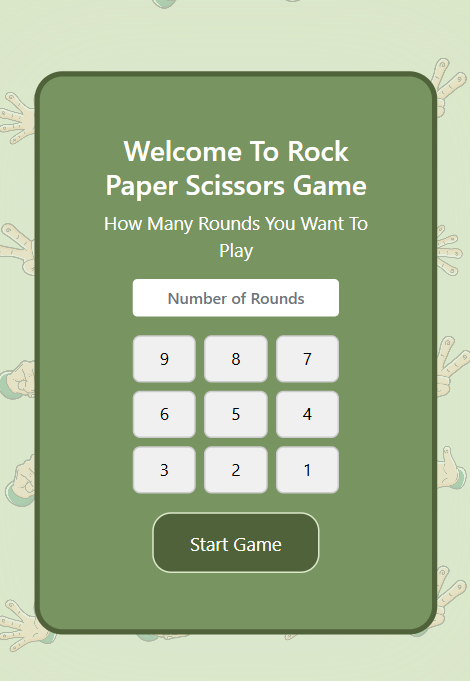
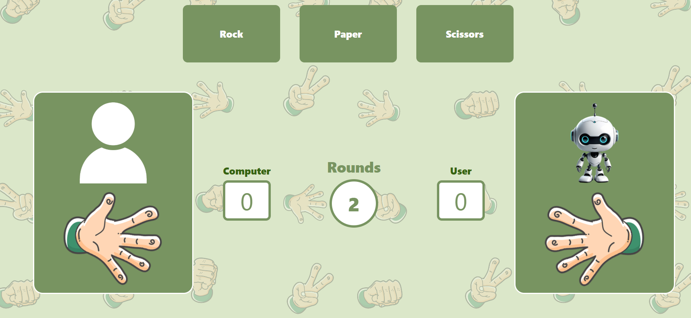
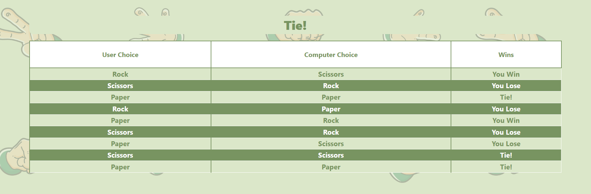

# Rock Paper Scissors Game ✊🖐✌

A simple and fun **Rock Paper Scissors** game built using **HTML**, **CSS**, and **JavaScript**.

## 🌐 Live Demo

👉 [Play the game here](https://rps007.netlify.app/)

## 📸 Screenshots

### 🎮 Game Start Screen



### 🕹️ Gameplay Screen



### 📊 Results Table



## 🚀 Features

- Play against the computer
- Dynamic score tracking
- Interactive UI with animations
- Clean and responsive design

## 🛠️ Technologies Used

- HTML5
- CSS3
- JavaScript (Vanilla)

## 📁 Project Structure

```

RPS\_Game/
├── index.html         # Main HTML file
├── style.css          # Styling of the game
└── script.js          # Game logic

```

## 📌 How to Use

1. Clone the repository:
   ```bash
   git clone https://github.com/SuhaimKhalid/RPS_Game.git
   ```

```

2. Open the `index.html` file in your browser.
3. Or visit the [Live Demo](https://rps007.netlify.app/) to play instantly.

## 🤝 Contributing

Pull requests are welcome. For major changes, please open an issue first to discuss what you'd like to change.

## 📄 License

This project is open source and available under the [MIT License](LICENSE).


```
